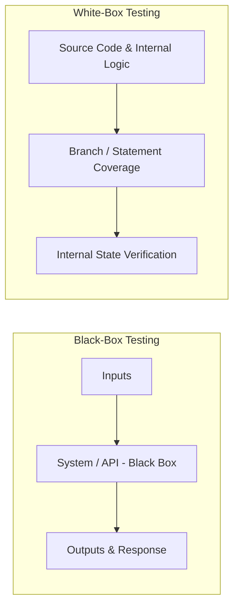

# Hands-On 1: QA Concepts, Functional Testing & Defect Lifecycle

**Course**: Digital Nurture 5.0 - Python Full Stack Engineer Track  
**Module**: QA Concepts & Test Automation  
**Author**: Senior QA Automation Architect  
**Target System**: Course Management API  

---

## 📋 Task 1: Map Testing Types to a Real System

### 1. Concrete Test Cases Across Testing Levels

Target System: **Course Management API** (Endpoints: `POST /api/courses/`, `GET /api/courses/{id}`, `PUT /api/courses/{id}`, `DELETE /api/courses/{id}`)

| Testing Level | Description & Concrete Test Case |
| :--- | :--- |
| **Unit Testing** | **Test Target**: `CourseValidator.validate_course_code(code: str) -> bool` function in isolation.<br>**Test Case**: Pass valid course code `"CS-101"` and verify the function returns `True`. Pass invalid code `"101-CS"` and verify it returns `False`. The database, web server, and HTTP layer are mocked. |
| **Integration Testing** | **Test Target**: API Request Controller + PostgreSQL Database integration.<br>**Test Case**: Call `POST /api/courses/` with valid JSON payload. Verify that the API layer successfully establishes an active DB transaction, inserts a record into the `courses` table, and returns HTTP status `201 Created` with the inserted database primary key `course_id`. |
| **System Testing** | **Test Target**: End-to-end Course Management System flow.<br>**Test Case**: Execute complete workflow: (1) Admin logs in via `/api/auth/login`, (2) Creates a course via `POST /api/courses/`, (3) Assigns an instructor via `POST /api/courses/{id}/instructors`, (4) Student enrolls via `POST /api/enrollments/`, (5) Verify updated enrollment count via `GET /api/courses/{id}`. |
| **User Acceptance Testing (UAT)** | **Test Target**: College Administrator Business Scenario.<br>**Test Case**: College Admin logs into the Admin Portal UI during semester planning, imports a CSV batch file containing 50 new courses for the Fall term, assigns semester credits, publishes the course catalog, and verifies that student enrollment schedules open cleanly without system errors. |

---

### 2. Functional vs. Non-Functional Testing Classification

- **Functional Testing**: Verifies **what** the system does against functional requirements and specifications. It tests business logic, inputs, outputs, data integrity, and API response payload structures.
- **Non-Functional Testing**: Verifies **how well** the system performs its functions under operational conditions. It evaluates performance metrics, scalability, security vulnerabilities, reliability, usability, and disaster recovery.

#### Concrete Non-Functional Test Case (Performance / Load Testing)
- **Scenario**: Concurrent User API Performance under peak enrollment load.
- **Test Details**: Using Locust/JMeter, simulate 500 concurrent College Admins executing `GET /api/courses/` queries over a 15-minute period.
- **Pass Criteria**: Response latency at the 95th percentile ($P_{95}$) must remain $< 200\text{ ms}$, error rate must be $0.00\%$, and system CPU/Memory consumption on backend nodes must stay below $75\%$.

---

### 3. Black-Box vs. White-Box Testing Comparison



| Dimension | Black-Box Testing | White-Box Testing |
| :--- | :--- | :--- |
| **Knowledge Required** | No knowledge of internal code structure, implementation language, or database schema. | Full access to source code, algorithms, control flow diagrams, and internal architecture. |
| **Focus** | Validates software behavior against external requirements, inputs, and outputs. | Validates code statements, decision branches, exception paths, and data flows. |
| **Testing Techniques** | Equivalence Partitioning, Boundary Value Analysis, Decision Tables, State Transition. | Statement Coverage, Branch Coverage, Path Testing, Mutation Testing. |
| **Primary Executor** | **QA Tester / Automation Engineer** (evaluates system behavior from user/client perspective). | **Software Developer / Unit Tester** (evaluates code correctness during development). |

---

### 4. Formal Test Cases for `POST /api/courses/` Endpoint

| Test Case ID | Description | Preconditions | Test Steps | Expected Result | Actual Result | Pass/Fail |
| :--- | :--- | :--- | :--- | :--- | :--- | :--- |
| **TC_COURSE_001** | Verify successful creation of a new course with valid payload. | 1. API server is running.<br>2. Auth token obtained with Admin privileges.<br>3. Course code `CS-501` does not exist in DB. | 1. Send `POST` to `/api/courses/`<br>2. Headers: `Authorization: Bearer <token>`, `Content-Type: application/json`<br>3. Body: `{"code": "CS-501", "name": "Advanced Software Architecture", "credits": 4}` | 1. HTTP Status Code: `201 Created`<br>2. Response body contains generated `course_id`, matching `code`, `name`, `credits`.<br>3. Record exists in DB `courses` table. | | |
| **TC_COURSE_002** | Verify error handling when creating a course with a duplicate course code. | 1. API server is running.<br>2. Auth token obtained.<br>3. Course `CS-101` already exists in DB. | 1. Send `POST` to `/api/courses/`<br>2. Headers: Valid token<br>3. Body: `{"code": "CS-101", "name": "Duplicate Intro Course", "credits": 3}` | 1. HTTP Status Code: `409 Conflict` (or `400 Bad Request`).<br>2. Response body contains error message: `"Course code CS-101 already exists."` | | |
| **TC_COURSE_003** | Verify validation error when mandatory field `name` is omitted. | 1. API server is running.<br>2. Valid Auth token. | 1. Send `POST` to `/api/courses/`<br>2. Body: `{"code": "CS-601", "credits": 3}` (Missing `name` field) | 1. HTTP Status Code: `422 Unprocessable Entity` (or `400 Bad Request`).<br>2. Validation error indicates: `"Field 'name' is required."` | | |

---

## 🐛 Task 2: Defect Lifecycle & Severity Classification

### 5. Complete Defect Lifecycle Diagram & Workflow

```text
               +------------------+
               |       NEW        |
               +--------+---------+
                        |
                        v
               +------------------+     Rejected / Duplicate
               |     ASSIGNED     +----------------------------+
               +--------+---------+                            |
                        |                                      v
                        v                             +-----------------+
               +------------------+     Deferred      |    REJECTED     |
               |       OPEN       +------------------>|       OR        |
               +--------+---------+                   |    DEFERRED     |
                        |                             +-----------------+
                        v
               +------------------+
               |      FIXED       |
               +--------+---------+
                        |
                        v
               +------------------+
               |      RETEST      |
               +---+----------+---+
                   |          |
      Failed Retest|          | Passed Retest
                   v          v
          +------------+  +---------------+
          | RE-OPENED  |  |   VERIFIED    |
          +-----+------+  +-------+-------+
                |                 |
                +---------------->v
                          +---------------+
                          |    CLOSED     |
                          +---------------+
```

#### Defect States Description
- **NEW**: Bug logged by QA tester; awaiting triage.
- **ASSIGNED**: Lead assigns bug to responsible developer.
- **OPEN**: Developer is actively investigating and fixing the bug.
- **FIXED**: Developer completes code fix and deploys to QA environment.
- **RETEST**: QA re-executes test cases against the fixed build.
- **VERIFIED**: QA confirms bug is fixed and system behaves correctly.
- **CLOSED**: Bug lifecycle officially completed.
- **RE-OPENED**: Retest fails; bug sent back to developer.
- **REJECTED**: Bug invalid, not reproducible, or works as designed.
- **DEFERRED**: Fix postponed to a future release based on project priority.

---

### 6. Defect Severity & Priority Classification Matrix

- **Severity**: Technical impact of the defect on system operation, functionality, or data integrity (Critical, High, Medium, Low).
- **Priority**: Business urgency defining how quickly the defect must be fixed in relation to release milestones (P1 - Immediate, P2 - High, P3 - Medium, P4 - Low).

| Defect Scenario | Severity | Priority | Justification |
| :--- | :--- | :--- | :--- |
| **a) POST /api/courses/ returns 500 Internal Server Error for all requests.** | **Critical** | **P1 (Blocker)** | **Severity**: System is entirely unusable for course creation; core functionality is blocked.<br>**Priority**: P1 because developers/testers cannot create data, blocking dependent automated tests and business workflows. Must fix immediately. |
| **b) Course names longer than 150 characters are silently truncated without an error.** | **High** | **P2** | **Severity**: High due to silent data corruption in the database without user notification.<br>**Priority**: P2 because it causes data integrity issues that require database cleanup, though system remains operational. |
| **c) The /docs Swagger page has a typo in the API description.** | **Low** | **P4** | **Severity**: Low because system logic, API code, and data processing are completely unaffected.<br>**Priority**: P4 because it is a cosmetic documentation glitch that can be fixed in routine cleanup. |
| **d) Login with correct credentials occasionally returns 401 on the first attempt (intermittent).** | **High** | **P1** | **Severity**: High because it undermines security/auth reliability and causes unexpected user friction.<br>**Priority**: P1 because intermittent auth bugs cause customer distrust, flaky test failures, and deeper session race conditions. |

---

### 7. Official Defect Report for Bug (a)

```markdown
================================================================================
DEFECT REPORT: DEF-2026-001
================================================================================
Defect ID      : DEF-2026-001
Title          : HTTP 500 Internal Server Error returned on POST /api/courses/ for all valid payloads
Project        : Course Management System API
Environment    : QA Staging (Server: qa-api-node-02.internal)
Build Version  : v2.4.0-rc1
Severity       : Critical
Priority       : P1 (Blocker)
Reporter       : Senior QA Automation Engineer
Assigned To    : Lead Backend Developer
Date Reported  : 2026-07-23

--------------------------------------------------------------------------------
SUMMARY
--------------------------------------------------------------------------------
Executing a POST request to /api/courses/ with a valid JSON payload consistently 
results in an unhandled HTTP 500 Internal Server Error. No database transaction 
is initiated.

--------------------------------------------------------------------------------
STEPS TO REPRODUCE
--------------------------------------------------------------------------------
1. Launch Postman or cURL terminal.
2. Obtain a valid Admin JWT Bearer Token via POST /api/auth/login.
3. Send POST request to endpoint: https://qa-api.coursemanagement.com/api/courses/
4. Set Headers:
   - Authorization: Bearer <JWT_TOKEN>
   - Content-Type: application/json
5. Send Request Body:
   {
     "code": "CS-999",
     "name": "Cloud Native Architecture",
     "credits": 4
   }

--------------------------------------------------------------------------------
EXPECTED RESULT
--------------------------------------------------------------------------------
API returns HTTP Status Code 201 Created with JSON response:
{
  "course_id": 1042,
  "code": "CS-999",
  "name": "Cloud Native Architecture",
  "credits": 4,
  "created_at": "2026-07-23T10:40:00Z"
}

--------------------------------------------------------------------------------
ACTUAL RESULT
--------------------------------------------------------------------------------
API returns HTTP Status Code 500 Internal Server Error with response body:
{
  "error": "InternalServerError",
  "message": "NullPointerException in CourseController.java:line 84"
}

--------------------------------------------------------------------------------
ATTACHMENTS & LOGS
--------------------------------------------------------------------------------
1. Attachment: screenshot_of_500_error.png
2. Server Log Snippet:
   [ERROR] 2026-07-23 10:40:15 c.c.api.controller.CourseController - 
   Failed to process course creation request: java.lang.NullPointerException: 
   Cannot invoke "CourseRepository.save(Object)" because "this.courseRepository" is null.
================================================================================
```

---

### 8. Severity vs. Priority Deep Dive with Real-World Examples

- **Severity** measures technical impact (how broken is the code?).
- **Priority** measures business urgency (how fast must we ship the fix?).

#### Example 1: High Severity, Low Priority
- **Scenario**: In an enterprise ERP application, clicking "Export Legacy Audit Logs (1998-2000) to PDF" crashes the application with an unhandled server exception (High Severity - total crash of feature).
- **Why Low Priority**: Only 1 user accesses 25-year-old audit logs once per year. Fix can be deferred to next quarter's release cycle without affecting daily revenue or core operations.

#### Example 2: Low Severity, High Priority
- **Scenario**: On a high-traffic E-Commerce site's checkout homepage, the main "BUY NOW" button has a spelling typo ("BYE NOW") or the company logo renders upside down on the home landing page (Low Severity - functionality works 100%).
- **Why High Priority**: Represents brand damage and user distrust. It must be fixed immediately within hours via hotfix (P1 Priority).
