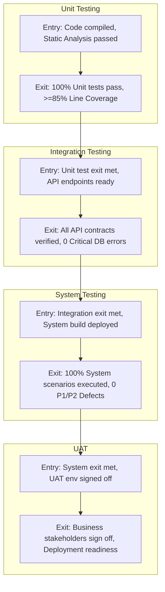

# Hands-On 2: SDLC vs TDLC — V-Model & Agile QA Integration

**Course**: Digital Nurture 5.0 - Python Full Stack Engineer Track  
**Module**: QA Concepts & Test Automation  
**Author**: Senior QA Automation Architect  

---

## 📐 Task 1: V-Model Mapping & Testing Lifecycles

### 9. Comprehensive V-Model Architecture Diagram

```text
  SOFTWARE DEVELOPMENT LIFECYCLE (SDLC)              TEST DEVELOPMENT LIFECYCLE (TDLC)
  =====================================              =================================
  
  [Requirements Specification] <=====================> [Acceptance Testing (UAT)]
           \                                                 /
            \                                               /
     [System Architecture Design] <==================> [System Testing]
              \                                           /
               \                                         /
        [Module / High-Level Design] <===========> [Integration Testing]
                 \                                     /
                  \                                   /
           [Detailed Component Design] <======> [Unit Testing]
                    \                                 /
                     \                               /
                      +-------> [ CODING ] <--------+
                              (Bottom Vertex)
```

---

### 10. SDLC ↔ TDLC Phase & Test Artifact Mappings

| SDLC Development Phase | Associated Test Artifact Produced | Description of QA Deliverable |
| :--- | :--- | :--- |
| **Requirements Specification** | **Acceptance Test Plan & UAT Matrix** | User Stories validation matrix, Acceptance Criteria, business scenarios, and UAT test plan document. |
| **System Architecture Design** | **System Test Plan & Performance Strategy** | End-to-end system workflows, environment architecture, Security & Load test plans. |
| **Module / High-Level Design** | **Integration Test Suites & API Stubs** | API endpoint contract definitions, payload schemas, integration interface dependency maps. |
| **Detailed Component Design** | **Unit Test Specifications & Test Data** | Function level test scenarios, boundary value datasets, mock objects, and code coverage requirements. |
| **Coding Phase** | **Test Automation Scripts & Fixtures** | Unit test execution scripts, CI pipeline scripts, automated smoke/regression runner suites. |

---

### 11. Entry & Exit Criteria for All 4 Testing Levels



| Testing Level | Entry Criteria (Prerequisites to Start) | Exit Criteria (Completion Requirements) |
| :--- | :--- | :--- |
| **Unit Testing** | 1. Source code cleanly compiles without warnings.<br>2. Static code analysis (Linter/SonarQube) passes.<br>3. Unit test framework (pytest/unittest) initialized. | 1. 100% of planned unit test cases executed.<br>2. Unit test pass rate = $100\%$.<br>3. Code line coverage $\ge 85\%$ and branch coverage $\ge 80\%$. |
| **Integration Testing**| 1. Unit testing exit criteria fully met.<br>2. API routes and DB schema migrations deployed.<br>3. Mock services/stubs configured. | 1. All inter-component API contracts validated.<br>2. Database transactions and rollback tests verified.<br>3. Zero open Critical or High severity integration bugs. |
| **System Testing** | 1. Integration testing exit criteria fully met.<br>2. End-to-end QA environment deployed.<br>3. Test data seeded across all subsystem databases. | 1. 100% planned end-to-end functional flows executed.<br>2. Pass rate $\ge 98\%$.<br>3. Zero P1 (Blocker) or P2 (High) open defects. |
| **User Acceptance (UAT)**| 1. System testing exit criteria signed off.<br>2. Staging environment mirrored with prod data.<br>3. User documentation & release notes completed. | 1. All business acceptance scenarios approved.<br>2. Product Owner and Business Stakeholder sign-off.<br>3. Operational readiness review completed. |

---

### 12. Two Early QA Engagement Points in V-Model

1. **Requirements Specification Review (Shift-Left Requirement Validation)**
   - **Engagement**: QA actively participates during initial API requirement refinement.
   - **Impact on Course Management API**: Identifies ambiguous requirement statements early (e.g., missing max length limits on course titles or undefined credit range validation rules) *before* developers write code, saving costly rework.

2. **System & Architecture Design Review (Testability & API Design)**
   - **Engagement**: QA reviews API architecture schemas, database constraints, and auth mechanisms.
   - **Impact on Course Management API**: Ensures endpoints expose mockable interfaces, predictable HTTP response status codes, and database isolation mechanisms necessary for automated test suite execution.

---

## 🏃 Task 2: Agile QA and Shift-Left Testing

### 13. Three Critical Problems of Traditional Waterfall Testing

For the **Course Management API** project:
1. **Defect Discovery at the End ("Defect Explosion")**:
   - Because testing only occurs after 3 months of development, critical architectural bugs (e.g., database deadlock during concurrent course enrollment) are found right before the release date, delaying launch.
2. **Exponentially High Cost of Defect Fixes**:
   - Fixing a requirement flaw found during System Testing costs up to $10\times - 100\times$ more than fixing it during requirement grooming due to extensive code refactoring.
3. **Compressed QA Timelines ("QA Squeeze")**:
   - When development overruns its schedule by 2 weeks, the hard release deadline squeezes QA execution time, forcing incomplete test coverage and high risk of production defects.

---

### 14. QA Engineer Role in Agile Ceremonies

```text
               +----------------------------------+
               |         SPRINT PLANNING          |
               | - Refine User Stories            |
               | - Define Acceptance Criteria     |
               | - Estimate QA Tasks & Automation |
               +----------------+-----------------+
                                |
                                v
+------------------------------------------------------------------+
|                          DAILY STANDUP                           |
| - Report QA progress & Automation blockers                       |
| - Identify environment or test data dependencies                 |
+--------------------------------+---------------------------------+
                                 |
                                 v
               +----------------------------------+
               |          SPRINT REVIEW           |
               | - Demo tested features           |
               | - Validate Acceptance Criteria   |
               +----------------+-----------------+
                                |
                                v
               +----------------------------------+
               |          RETROSPECTIVE           |
               | - Analyze test suite stability   |
               | - Improve QA processes & tools   |
               +----------------------------------+
```

---

### 15. Four Concrete Shift-Left Practices

#### Practice (a): Reviewing Requirements for Testability
- **Application**: QA reviews story *"Allow admin to add courses"*. QA identifies missing edge cases: *"What happens if credit value is negative or floating point?"*. Requirement updated to specify integer range $1 \le \text{credits} \le 6$ *before* coding starts.

#### Practice (b): Writing Test Cases Before Code (TDD / BDD)
- **Application**: Developers and QA write executable Gherkin feature files (`.feature`) and failing PyTest step definitions before API backend code is implemented. Code development stops as soon as the test turns green.

#### Practice (c): Automated Static Code Analysis in CI Pipeline
- **Application**: Integrating `flake8`, `mypy`, and `SonarQube` into the Git pre-commit and PR workflows. Automatically blocks pull requests that fail PEP8 standards, contain security vulnerabilities (e.g., hardcoded database passwords), or exceed complexity thresholds.

#### Practice (d): API Contract Testing (Pact / OpenAPI Spec Validation)
- **Application**: Defining OpenAPI 3.0 specs (`swagger.json`) for `POST /api/courses/`. QA runs contract validation tests against API schemas before frontend-backend integration, preventing mismatch in JSON key naming (e.g., `course_title` vs `name`).

---

### 16. Acceptance Criteria in Given-When-Then (Gherkin) Format

**User Story**: *As a college admin, I want to create a new course, so that students can enroll in it.*

```gherkin
Feature: Course Creation API
  In order to manage college curriculum
  As a College Administrator
  I want to create new course records with validated data

  @happy_path @smoke
  Scenario: Successfully create a new valid course
    Given the College Admin is authenticated with valid JWT token
    And the course code "CS-301" does not exist in the catalog
    When the admin submits a "POST" request to "/api/courses/" with payload:
      """
      {
        "code": "CS-301",
        "name": "Data Structures & Algorithms",
        "credits": 4
      }
      """
    Then the API response status code should be 201
    And the response payload should contain "course_id"
    And the course "CS-301" should exist in the system database

  @negative @duplicate_code
  Scenario: Reject creation of course with duplicate course code
    Given the College Admin is authenticated with valid JWT token
    And a course with code "CS-101" already exists in the catalog
    When the admin submits a "POST" request to "/api/courses/" with payload:
      """
      {
        "code": "CS-101",
        "name": "Duplicate Computer Science Intro",
        "credits": 3
      }
      """
    Then the API response status code should be 409
    And the response error message should be "Course code CS-101 already exists."

  @negative @field_validation
  Scenario: Reject creation when required field 'name' is missing
    Given the College Admin is authenticated with valid JWT token
    When the admin submits a "POST" request to "/api/courses/" with payload:
      """
      {
        "code": "CS-404",
        "credits": 3
      }
      """
    Then the API response status code should be 422
    And the response validation error should specify "Field 'name' is required."
```
