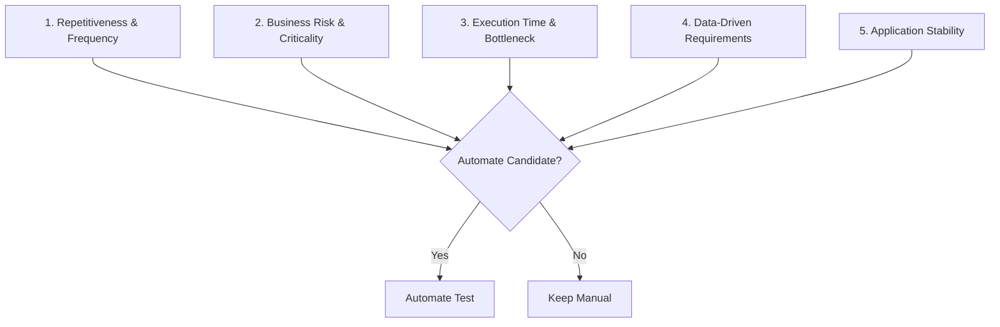

# Hands-On 3: Test Automation Process, Lifecycle & Framework Types

**Course**: Digital Nurture 5.0 - Python Full Stack Engineer Track  
**Module**: Test Automation Strategy & Architecture  
**Author**: Senior QA Automation Architect  

---

## 🎯 Task 1: Automation Decision & Test Case Selection

### 17. Five Key Criteria for Test Automation Selection

When deciding whether to automate a test scenario, QA leads evaluate five core decision criteria:



1. **Repetitiveness & Frequency**: Scenarios executed repeatedly in every CI/CD build or regression run.
2. **Business Risk & Criticality**: Core business paths whose failure directly impacts revenue or compliance.
3. **Execution Bottleneck & Time Savings**: Time-consuming manual test steps (e.g., matrix testing, data setup).
4. **Data-Driven Requirements**: Tests requiring execution across multi-parameter input sets.
5. **Application UI/API Stability**: Stable endpoints whose specifications are settled.

#### Application to Scenario
*Scenario*: *"Test that the POST /api/courses/ endpoint returns 201 with the correct course data when valid input is provided."*

- **Repetitiveness**: High. Executed in every build to verify core backend health.
- **Business Risk**: High. Failure prevents course enrollment and breaks core functionality.
- **Execution Bottleneck**: High when tested manually with multiple data variations.
- **Data-Driven**: High. Can be parameterized with 50+ course combinations.
- **Stability**: Stable REST API contract.
- **Conclusion**: **AUTOMATE IMMEDIATELY**.

---

### 18. Manual vs. Automate Decision Matrix

| # | Test Scenario | Decision | Justification |
| :- | :--- | :--- | :--- |
| **a** | Regression test for all CRUD endpoints after every code change. | **Automate** | Highly repetitive, critical path, stable API endpoints. Ideal candidate for automated CI regression suite. |
| **b** | Exploratory testing of a new search feature. | **Manual** | Requires human intuition, creative edge-case discovery, and ad-hoc reasoning. Not repeatable upfront. |
| **c** | Performance test: 100 concurrent users calling `GET /api/courses/`. | **Automate** | Physically impossible to perform manually with 100 human testers synchronously. Requires JMeter/Locust automation scripts. |
| **d** | UI test for the login form. | **Automate** | Basic UI smoke test; highly stable; critical entry point executed on every build. |
| **e** | Verify the API documentation (Swagger) is accurate. | **Manual** | Documentation accuracy and visual clarity require human visual inspection and subjective comprehension. |
| **f** | Smoke test: verify the API is reachable after deployment. | **Automate** | High-frequency post-deployment verification script running in CD pipeline to confirm environment health in $< 5\text{ seconds}$. |

---

### 19. Test Automation ROI Calculation

#### ROI Definition
**Test Automation ROI (Return on Investment)** measures the net economic and time benefit derived from automating test cases compared to manual test execution, accounting for initial script development costs and ongoing maintenance overhead.

$$\text{ROI} = \frac{\text{Cumulative Manual Cost} - (\text{Automation Development Cost} + \text{Cumulative Maintenance Cost})}{\text{Automation Development Cost} + \text{Cumulative Maintenance Cost}} \times 100\%$$

#### Given Variables
- Initial Automation Development Time ($C_{dev}$): $4\text{ hours} = 240\text{ minutes}$
- Manual Execution Time per Run ($M$): $30\text{ minutes} = 0.5\text{ hours}$
- Automation Maintenance Overhead ($O$): $20\%$ of initial manual execution cost per run ($0.20 \times 30\text{ min} = 6\text{ min/run}$) applied after the 10th run.

#### Step-by-Step Mathematical Calculation

- **Manual Execution Cost for $N$ runs**: $T_{\text{manual}}(N) = 30 \times N\text{ minutes}$
- **Automation Execution Cost for $N$ runs**:
  - Execution time per automated run is negligible ($\approx 0.5\text{ min}$).
  - For $N \le 10$: $T_{\text{auto}}(N) = 240\text{ minutes}$
  - For $N > 10$: $T_{\text{auto}}(N) = 240 + 6 \times (N - 10)\text{ minutes}$

Let's find break-even run count $N$:

For $N \le 10$:
$$30N = 240 \implies N = 8\text{ runs}$$

Since $N = 8 \le 10$, the break-even point occurs exactly at **8 runs**!

```text
Run Count (N)  Manual Cumulative (min)  Auto Cumulative (min)  Net Savings (min)
-------------  -----------------------  ---------------------  -----------------
1              30                       240                    -210
4              120                      240                    -120
8 (Break-Even) 240                      240                       0 (PAYS FOR ITSELF)
10             300                      240                    +60
15             450                      270                    +180
20             600                      300                    +300
```

**Conclusion**: The automated test pays for itself on the **8th run**. Beyond 8 runs, every execution yields net time savings, accumulating **300 minutes (5 hours)** of net QA savings by the 20th run.

---

### 20. Flaky Test Analysis & Prevention Strategies

#### Definition
A **Flaky Test** is an automated test script that produces inconsistent results (sometimes passes, sometimes fails) when executed on the exact same codebase without any code changes. Flaky tests erode team confidence in automation.

#### Example Scenario in Selenium
A test clicks a `"Submit Course"` button and immediately asserts `driver.find_element(By.ID, "success-msg").text == "Saved"`. On fast machines, it passes; on slow CI servers, `find_element` executes before AJAX completes, throwing `NoSuchElementException`.

#### 3 Strategies to Prevent/Fix Flaky Tests in Selenium
1. **Replace Implicit Waits and `time.sleep()` with Explicit Waits (`WebDriverWait`)**:
   - Use `WebDriverWait(driver, 10).until(EC.visibility_of_element_located(...))` so the script dynamically waits up to 10 seconds, resuming instantly when the DOM updates.
2. **Implement Smart Element Scroll and State Verification**:
   - Ensure elements are scrolled into the viewport (`scrollIntoView()`) and check `EC.element_to_be_clickable()` before clicking to avoid `ElementClickInterceptedException`.
3. **Isolate Test State & Database Seeding**:
   - Give each test case independent, unique test data (e.g., dynamic timestamps or UUIDs like `CS-TEST-9482`) to prevent data race conditions between parallel test workers.

---

## 🏗️ Task 2: Compare Automation Framework Types

### 21. Comparative Analysis of 5 Framework Architectures

#### 1. Linear Framework (Record & Playback / Flat Scripts)
- **Description**: Sequential test scripts where locators, actions, and test data are hardcoded into a single monolithic file without functions or classes.
- **Advantage**: Fast creation speed for one-off proof-of-concept (POC) scripts.
- **Disadvantage**: Extremely high maintenance cost; any UI locator change breaks dozens of scripts.
- **Course Management Example**: A single `.py` script hardcoding login, navigating to courses, typing course fields, and asserting text in 50 sequential lines.

#### 2. Modular Framework
- **Description**: Divides the application into independent logical modules (e.g., Auth Module, Course Module) and encapsulates actions into reusable functions.
- **Advantage**: High code reusability; updating a function updates all tests using it.
- **Disadvantage**: Test data remains hardcoded inside script function calls.
- **Course Management Example**: Creating a `login(driver, user, pwd)` function reused across 20 different test scripts.

#### 3. Data-Driven Framework
- **Description**: Separates test logic from test data. Data is loaded from external files (CSV, Excel, JSON, YAML) and fed iteratively into parameterized test functions.
- **Advantage**: Multiplies test coverage without duplicating code; easily tests boundary conditions.
- **Disadvantage**: Requires complex data parsing logic and error handling for malformed data.
- **Course Management Example**: Running a single `test_create_course` function against a CSV file containing 50 different course code/credit parameters.

#### 4. Keyword-Driven Framework
- **Description**: Uses keywords (e.g., `ClickButton`, `EnterText`, `VerifyText`) stored in Excel sheets alongside target locator identifiers to define test steps.
- **Advantage**: Enables non-technical team members (manual QA/business analysts) to create tests by writing spreadsheet keywords.
- **Disadvantage**: Complex initial framework design and maintenance of key-action mapping engines.
- **Course Management Example**: An Excel sheet with columns `[Step, Action, Locator, Value]` executing `["1", "EnterText", "id=user-message", "Hello"]`.

#### 5. Hybrid Framework
- **Description**: Combines the best features of Modular, Data-Driven, Keyword-Driven, and Page Object Model patterns into an integrated architecture.
- **Advantage**: Maximum scalability, maintainability, clean separation of concerns, and robust reporting.
- **Disadvantage**: Higher initial setup time and steep learning curve for junior engineers.
- **Course Management Example**: A POM framework driven by PyTest parameterization, reading YAML configs, and producing HTML reports.

---

### 22. Framework Recommendation for Course Management System

#### Team Requirements
- Test login with 50 user/password combinations.
- Reuse login steps across 20 test cases.
- Support both technical (automation developers) and non-technical (manual QA) team members.

#### Recommendation: **Hybrid Framework (POM + PyTest Data-Driven + BDD / Behave Layer)**

#### Justification
1. **Modular Reusability (POM)**: Encapsulates login into a `LoginPage` class (`login_page.login(user, pwd)`), solving the requirement to reuse login steps across 20 test cases.
2. **Data-Driven Parameterization**: PyTest parameterization (`@pytest.mark.parametrize`) or JSON/CSV readers allow iterating the login method over the 50 user/password dataset cleanly.
3. **BDD Integration (Gherkin/Behave)**: Non-technical team members can write test scenarios in human-readable Given-When-Then format, while technical engineers implement the underlying Page Objects in Python.

---

### 23. Proposed Hybrid Framework Architecture Diagram

```text
CourseManagement_Automation/
│
├── config/
│   ├── config.yaml                   # Global environments, URLs, timeouts
│   └── secrets.json                  # Environment credentials
│
├── test_data/
│   ├── courses_data.json             # Parameterized course payloads
│   └── users_credentials.csv          # 50 user login combinations
│
├── pages/                             # Page Object Model Layer (Modular)
│   ├── base_page.py                  # Common WebDriver wrappers
│   ├── login_page.py                 # Login locators & actions
│   └── course_page.py                # Course creation locators & actions
│
├── features/                          # BDD Layer (For Non-Technical Users)
│   ├── login.feature                 # Gherkin scenarios
│   └── course_management.feature
│
├── step_defs/                         # BDD Step Definitions
│   └── test_course_steps.py
│
├── tests/                             # PyTest Test Suite (Technical Engineers)
│   ├── conftest.py                   # Drivers, fixtures, failure hooks
│   ├── test_login.py
│   └── test_courses.py
│
├── utils/                             # Shared Utilities
│   ├── excel_reader.py               # Data parser helpers
│   ├── logger.py                     # Logging configuration
│   └── wait_helpers.py               # Custom explicit waits
│
├── reports/                           # Output Artifacts
│   ├── report.html                   # HTML Test Execution Report
│   └── screenshots/                  # Failure screenshots
│
├── pytest.ini                         # Execution configuration
└── requirements.txt                   # Dependency manifest
```
