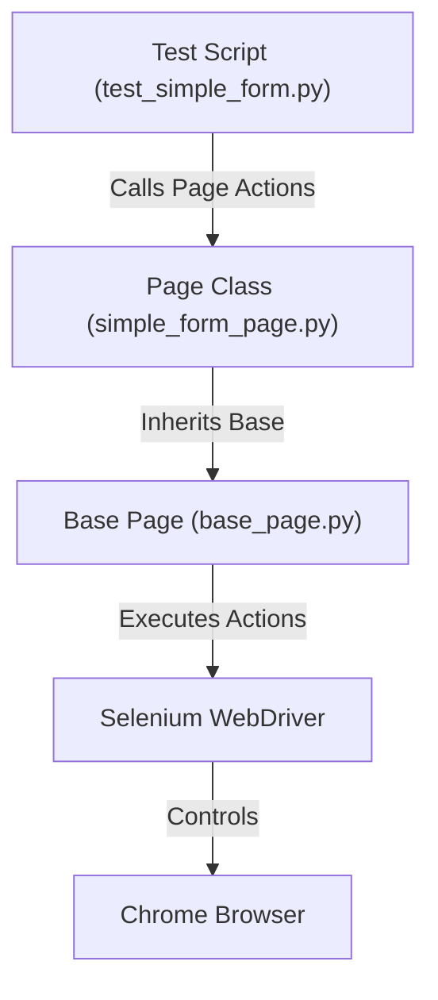

# Selenium Basics Automation & QA Concepts Master Suite


This repository contains the complete, enterprise-grade implementation of all 7 Hands-On exercises from the **Digital Nurture 5.0 - Python Full Stack Engineer Track (QA Concepts & Test Automation — Selenium Basics)**.

---

## 📋 Project Overview

The repository systematically builds QA automation expertise, progressing from fundamental QA theory and defect lifecycle management to advanced Selenium WebDriver automation, PyTest frameworks, dynamic synchronization, and Page Object Model (POM) design patterns.

Target Practice Web Application: [LambdaTest Selenium Playground](https://www.lambdatest.com/selenium-playground/)

---

## Folder Structure

```text
SeleniumBasics/
│
├── README.md                           # Master project documentation
├── requirements.txt                    # Project Python dependencies
├── .gitignore                          # Git ignore configuration
├── pytest.ini                          # Root PyTest execution settings
│
├── HandsOn1_QA_Concepts/              # QA Theory: Testing levels, types & defect lifecycle
│   └── qa_concepts.md
│
├── HandsOn2_SDLC_TDLC/                # Software & Test Lifecycles: V-Model & Agile QA
│   └── v_model_analysis.md
│
├── HandsOn3_Automation_Strategy/      # Automation Decisions, ROI & Framework Architectures
│   └── automation_strategy.md
│
├── HandsOn4_Selenium_Setup/           # Selenium Setup, Navigation & Window Handling
│   ├── setup_test.py
│   ├── navigation_windows.py
│   └── screenshots/
│
├── HandsOn5_Locators_Waits/           # Locator Strategies & Synchronization (Explicit/Fluent)
│   ├── locators_demo.py
│   ├── explicit_waits.py
│   └── fluent_wait.py
│
├── HandsOn6_PyTest_Framework/         # PyTest Integration, Fixtures, Parameterization & Reports
│   ├── conftest.py
│   ├── pytest.ini
│   ├── test_playground.py
│   └── screenshots/
│
├── HandsOn7_PageObjectModel/         # Production-grade Page Object Model Framework
│   ├── pages/                         # Page Object classes (base, form, checkbox, dropdown)
│   │   ├── base_page.py
│   │   ├── simple_form_page.py
│   │   ├── checkbox_page.py
│   │   ├── dropdown_page.py
│   │   └── input_form_page.py
│   ├── tests/                         # Pure test files with zero direct driver element calls
│   │   ├── conftest.py
│   │   ├── test_simple_form.py
│   │   ├── test_checkbox.py
│   │   ├── test_dropdown.py
│   │   └── test_input_form.py
│   ├── utils/                         # Reusable configuration & wait utilities
│   │   ├── config.py
│   │   └── wait_utils.py
│   └── README.md                      # Detailed POM architecture documentation
│
└── docs/                              # Project index and architecture reference
    └── index.md
```

---

##  Python Version & Virtual Environment Setup

### Required Python Version
- **Python 3.12** (or Python 3.10+)

### 1. Creating Virtual Environment

On Windows (PowerShell / CMD):
```powershell
python -m venv venv
.\venv\Scripts\Activate
```

On macOS / Linux:
```bash
python3 -m venv venv
source venv/bin/activate
```

### 2. Installing Dependencies

```bash
pip install --upgrade pip
pip install -r requirements.txt
```

#### Package Manifest (`requirements.txt`)
- `selenium>=4.20.0`: Browser automation API
- `pytest>=8.0.0`: Test execution & fixture management framework
- `webdriver-manager>=4.0.1`: Automated browser driver binary downloading & management
- `pytest-html>=4.1.1`: Rich HTML test execution reporting plugin

---

##  Using `webdriver-manager`

This project uses `webdriver-manager` to eliminate manual ChromeDriver downloading and path management issues.

```python
from selenium import webdriver
from selenium.webdriver.chrome.service import Service
from webdriver_manager.chrome import ChromeDriverManager

# Automatically downloads matching ChromeDriver binary and initializes WebDriver
driver = webdriver.Chrome(service=Service(ChromeDriverManager().install()))
```

- **Headless Mode Support**: Enabled via `ChromeOptions()` in headless environments (e.g. CI/CD pipelines).
- Drivers are cached automatically in `~/.wdm/`.

---

##  Running Individual Hands-On Exercises

### Hands-On 4: Selenium Setup & Navigation
```bash
python HandsOn4_Selenium_Setup/setup_test.py
python HandsOn4_Selenium_Setup/navigation_windows.py
```

### Hands-On 5: Locators & Waits
```bash
python HandsOn5_Locators_Waits/locators_demo.py
python HandsOn5_Locators_Waits/explicit_waits.py
python HandsOn5_Locators_Waits/fluent_wait.py
```

---

##  Running PyTest Test Suites

### Run Hands-On 6 PyTest Suite
```bash
pytest HandsOn6_PyTest_Framework/ -v
```

### Run Hands-On 7 Page Object Model (POM) Test Suite
```bash
pytest HandsOn7_PageObjectModel/tests/ -v
```

### Run Entire Repository Test Suite
```bash
pytest -v
```

---

## Generating HTML Reports

To generate a standalone, self-contained HTML test report:

```bash
pytest --html=report.html --self-contained-html
```

The generated `report.html` includes test execution statuses (PASSED/FAILED), durations, parameter sets, stack traces, and automatic failure screenshot attachments.

---

##  Page Object Model (POM) Explanation

The **Page Object Model** is an industry-standard architectural pattern in test automation that separates **what to test** (test scripts) from **how to interact with the UI** (page objects).



### Key Principles Applied:
1. **Strict Separation of Concerns**: Test files contain ONLY assertions; page object files contain ONLY element locators and interaction methods.
2. **Zero `driver.find_element` in Tests**: Test files interact solely through high-level page methods (e.g., `page.enter_message("Hello")`).
3. **Single Source of Maintenance**: Class-level locator tuples (`MESSAGE_INPUT = (By.ID, "user-message")`) are maintained in one place per page. If an element ID changes on the website, only one line in one file needs updating.

---

##  Project Screenshots Section

Screenshots captured during test failures or manual automation runs are stored in:
- `HandsOn4_Selenium_Setup/screenshots/`
- `HandsOn6_PyTest_Framework/screenshots/`

Automated failure capture hook in `conftest.py`:
```python
@pytest.hookimpl(tryfirst=True, hookwrapper=True)
def pytest_runtest_makereport(item, call):
    outcome = yield
    report = outcome.get_result()
    if report.when == "call" and report.failed:
        driver = item.funcargs.get("driver")
        if driver:
            screenshot_path = f"screenshots/{item.name}_failure.png"
            driver.save_screenshot(screenshot_path)
```

---

##  GitHub Submission Instructions

1. **Initialize Git Repository**:
   ```bash
   git init
   git add .
   git commit -m "Feat: Complete Selenium Basics Hands-On 1 to 7 implementation"
   ```

2. **Push to Remote Repository**:
   ```bash
   git branch -M main
   git remote add origin https://github.com/<your-username>/SeleniumBasics.git
   git push -u origin main
   ```

3. **Share Repository Link**:
   Provide your GitHub repository URL to your Point of Contact (POC).
